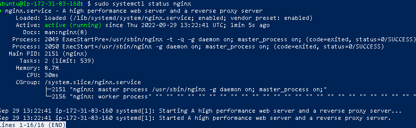

# **AWESOME DOCUMENTATION FOR PROJECT_2 - LEMP**


## This project is about installing web stack application using lamp(linux nginx mysql php).
\
\
\
\
___
## __**Step_1** # __Installation for ubuntu-linux OS____
___

## _The installation of the linux OS is done on aws platform_
\
### __After setting up your aws EC2 instance, next you lauch the instance by adding security group.__
\
### __When adding security group, create a new security group, then set inbound and outbound rules__

* __inbound rules__
    * set ssh at port 22, all trafic at 0.0.0.0
    * set http at port 80, all trafic at 0.0.0.0
* __outbound rules__
    * set all trafic for all


\
\
## _ssh into the VM from powershell terminal_
\
__First navigate to where you kept the .pem file__

\
__Then run this:__

```ssh -i <private-key-name>.pem ubuntu@<Public-IP-address>```

\
## _Run the following commands on Powershell for nginx, mysql and php setup_
\
\
\
\
\
___
## __**Step_2** # __Installation for nginx____
___

\
__First install nginx server by doing:__

```
sudo apt update

sudo apt install nginx
```

### #__verify nginx status__
```
sudo systemctl status nginx
```
## *__Result:__

\
\
\




\
\
## #__Add TCP:80 and SSH:22 Ports on AWS security group inbound rules__


\
__Check for connectivity on ubuntu shell by:__
```curl http://localhost:80```

\
__Test nginx HTTP server on web browser__
```http://<ipv4 of VM>:80```

\
\
\
__*Result:__
\
\


\
\
\
\
\
___
## __**Step_3** # Installation for Mysql__
___

\
__ First install mysql-server__
\
```sudo apt install mysql-server```

\
### #__login into mysql__

```sudo mysql```

\
\
### *__Result:__


\
\
\
### #__Change native password__

```ALTER USER 'root' @'localhost' IDENTIFIED WITH mysql_native_password BY 'PassWord.1' ;```

\
### #__Logout of  mysql__

```mysql > exit```

\
### #__Run the security script to validate password__
```sudo mysql_secure_installation```

\
### _put in a new password, then tpye y for all._

\
\
### #__Login to the MYSQL console__

`sudo mysql -p`
\
\
\
\
\
___
## __**Step_4** # __Installation for php____
___

### __--start php by installing it, first--__
```sudo apt install php-fpm php-mysql```

\
### __confirm php installation/version__
```php -v```

\
__*Result:__

\
\
\
\
## __Creation of a virtual host__

### _The domain name is setup by creatiing directories_

\
__Directory for projectlamp__

```sudo mkdir /var/www/projectLEMP```

\
__Next, assign ownership to projectLEMP directory.__

```sudo chown -R $USER:$USER /var/www/projectLEMP```
\
\
__create and configure sites-available directory__

```sudo nano /etc/nginx/sites-available/projectLEMP.conf```
\
\
__copy this and paste in this file.__

```
#/etc/nginx/sites-available/projectLEMP

server {
    listen 80;
    server_name projectLEMP www.projectLEMP;
    root /var/www/projectLEMP;

    index index.html index.htm index.php;

    location / {
        try_files $uri $uri/ =404;
    }

    location ~ \.php$ {
        include snippets/fastcgi-php.conf;
        fastcgi_pass unix:/var/run/php/php7.4-fpm.sock;
     }

    location ~ /\.ht {
        deny all;
    }

}
```

__Activate your configuration by linking to the config file from Nginx’s sites-enabled directory:__

```sudo ln -s /etc/nginx/sites-available/projectLEMP /etc/nginx/sites-enabled/```

\
__test your configuration for syntax errors by typing:__

```sudo nginx -t```

\
__You shall see this:__

\
__*Result__


\
__You need to disable default Nginx host that is currently configured to listen on port 80, for this run:__

```sudo unlink /etc/nginx/sites-enabled/default```

\
__Reload nginx to effect changes__

```sudo systemctl reload nginx```


\
**Your new website is now active, but the web root /var/www/projectLEMP is still empty. Create an index.html file**

\
```sudo echo 'Hello LEMP from hostname' $(curl -s http://169.254.169.254/latest/meta-data/public-hostname) 'with public IP' $(curl -s http://169.254.169.254/latest/meta-data/public-ipv4) > /var/www/projectLEMP/index.html```

\
__open browser and check out this using__

```http://<ipv4>:80```


### __OR__use__
\
```http://Public-DNS-Name:80```

\
__*Expected Result:__
\
\


\
\
\
\
___
## __**Step_5** # Test it to validate that Nginx can correctly hand .php files off to your PHP processor__
___
You can do this by creating a test PHP file in your document root. Open a new file called index.php

```sudo nano /etc/nginx/mods-enabled/dir.conf```

\
__Reload nginx__

```sudo systemctl reload nginx```

__create info.php file by typing this command__

```nano /var/www/projectLEMP/info.php```

__type this into this file__

```
<?php

phpinfo();

```
__You can now access this page in your web browser by visiting the domain name or public IP address/index.php__

```http://`server_domain_or_IP`/index.php```

Expected Result:
\
\


\
_Remove index.php file for security and privacy issues._

`sudo rm /var/www/projectLEMP/info.php`

\
\
\
\
___
## **Step_6** # __Retrieving data from MySQL database with PHP__
___
\
__--In this step you will create a test database (DB) with simple “To do list” and configure access to it, so the Nginx website would be able to query data from the DB and display it.--__

\
__We’ll need to create a new user with the mysql_native_password authentication method in order to be able to connect to the MySQL database from PHP__

\
__We will create a database named example_database and a user named example_user__

\
__First, connect to the MySQL console using the root account__

```sudo mysql -p```

\
__To create a new database, run the following command from your MySQL console__

\
```mysql> CREATE DATABASE `example_database`;```

\
__The following command creates a new user named example_user, using mysql_native_password as default authentication method. We’re defining this user’s password as password__

\
```mysql>  CREATE USER 'example_user'@'%' IDENTIFIED WITH mysql_native_password BY 'password';```

\
__Now we need to give this user permission over the example_database database:__

\
```mysql> GRANT ALL ON example_database.* TO 'example_user'@'%';```

\
__exit the MySQL shell with:__

\
```mysql > exit```

\
__Logging in to the MySQL console again, this time using the custom user credentials__

\
```mysql -u example_user -p```

\
__After logging in to the MySQL console, confirm that you have access to the example_database database:__

\
```mysql> SHOW DATABASES;```
\
\
__*Expected Result__
\
\


\
__Next, we’ll create a test table named todo_list. From the MySQL console, run the following statement:__

\
```
CREATE TABLE example_database.todo_list (
item_id INT AUTO_INCREMENT,
content VARCHAR(255),PRIMARY KEY(item_id)
);
```


\
### Insert a few rows of content in the test table by runing this command

\
```INSERT INTO example_database.todo_list (content) VALUES ("My first important item");
INSERT INTO example_database.todo_list (content) VALUES ("My second important item");
INSERT INTO example_database.todo_list (content) VALUES ("My third important item");
INSERT INTO example_database.todo_list (content) VALUES ("and this one more thing");```

\
\
### To confirm that the data was successfully saved to your table, run

```mysql>  SELECT * FROM example_database.todo_list;```

__ logout from mysql__

```mysql > exit```


\
\
### create a PHP script that will connect to MySQL and query for your content. Create a new PHP file in your custom web root directory

```nano /var/www/projectLEMP/todo_list.php```

__paste this into todo_list.php__

```
<?php
$user = "example_user";
$password = "password";
$database = "example_database";
$table = "todo_list";
```
```
try {
  $db = new PDO("mysql:host=localhost;dbname=$database", $user, $password);
  echo "<h2>TODO</h2><ol>";
  foreach($db->query("SELECT content FROM $table") as $row) {
    echo "<li>" . $row['content'] . "</li>";
  }
  echo "</ol>";
} catch (PDOException $e) {
    print "Error!: " . $e->getMessage() . "<br/>";
    die();
}
```

\
### __Now you can access your database through your browser by using:__

\

```
http://<Public_domain_or_IP>/todo_list.php
```

\
__*Result__
\
\


## __Congratulation done and dusted with LEMP__

